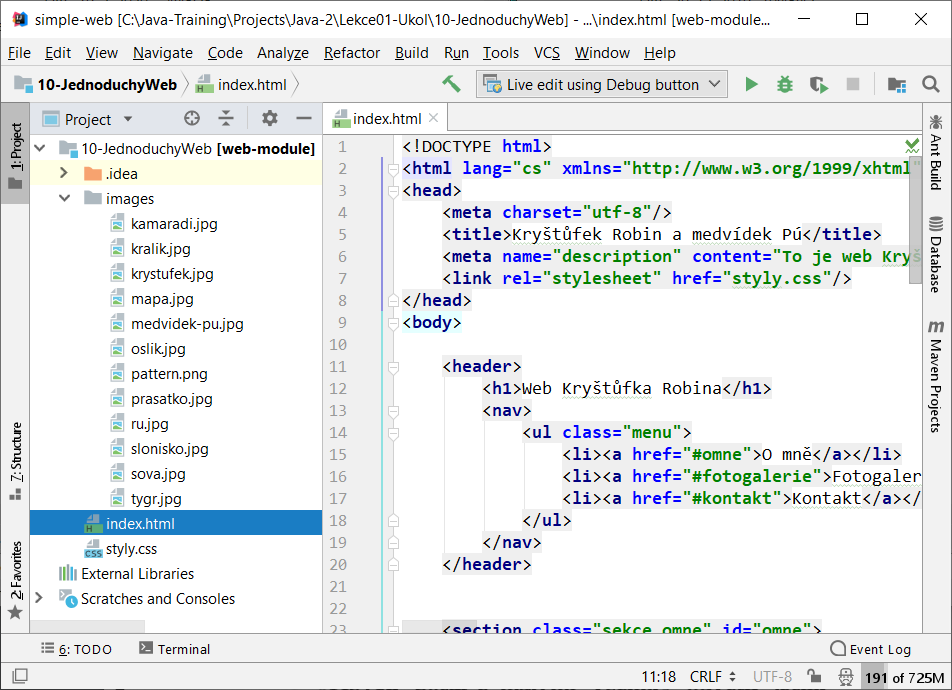
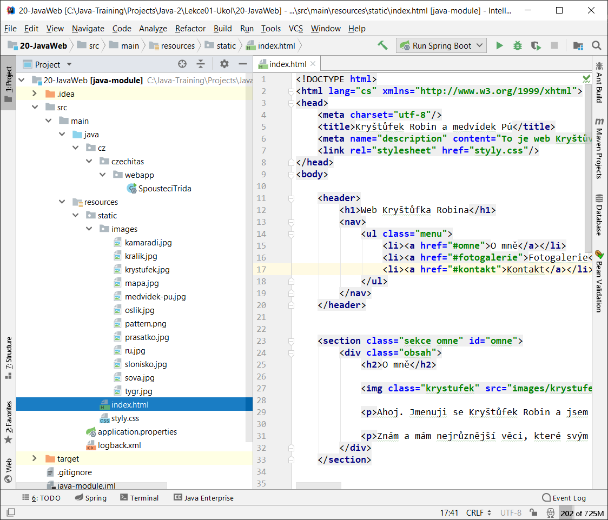

Lekce 01 - Úkol
===============

Úkol - Experimentování se statickým webem a Tomcatem
----------------------------------------------------

Cílem domácího úkolu je vytvořit 2 jednoduché statické weby a nasadit je na váš Tomcat.cloud.

1. Váš osobní webík o čemkoliv
1. Rozcestník domácích úkolů

### Krátký popis

#### Část 1 a 2 - Váš osobní webík

Úkolem bude připravit si svůj osobní web (například na úrovni jednodenního workshopu Tvořím web HTML/CSS
[https://www.czechitas.cz/cs/co-delame/tvorim-web](https://www.czechitas.cz/cs/co-delame/tvorim-web)). Webové stránky
(index.html, styly.css, ...) můžete buď napsat v nově založeném projektu v IntelliJ IDEA od začátku nebo použít
existující webové soubory a přidat je do nově založeného projektu v IntelliJ IDEA. Tak jako tak je třeba web nasadit
lokálně na Tomcat a odladit. Odladěný web bude třeba nasadit na Tomcat.cloud.

#### Část 3 - Webový rozcestník k domácím ukolům

Druhý statický web, který bude třeba vytvořit, je úvodní stránka, která bude fungovat jako rozcestník pro vaše domácí
úkoly na Tomcat.cloudu.

I ten bude za úkol vytvořit v projektu v IntelliJ IDEA a nasadit na Tomcat.cloud.

Ukázku řešení lze najít na

* [http://margot.tomcat.cloud/](http://margot.tomcat.cloud/)
* [http://margot.tomcat.cloud/ukol01simple/](http://margot.tomcat.cloud/ukol01simple/)
* [http://margot.tomcat.cloud/ukol01/](http://margot.tomcat.cloud/ukol01/)

### Detailní popis

#### Část 1 - Váš osobní webík

Abychom měli s čím experimentovat, budeme potřebovat nějaký váš web. Může to klidně být i váš již existující web nebo
statické webové stránky odkudkoliv. Pokud se necítíte na tvorbu vlastního webu, můžete si klidně půjčit nějaký
existující web. Například [http://krystufek.rolecek.cz/](http://krystufek.rolecek.cz/). Pro psaní webu existuje na internetu spousta návodů.

Web můžete tvořit v libovolném textovém editoru. Za úkol je ale vyzkoušet IntelliJ IDEA. V IntelliJ IDEA založte nový
projekt -> Static web -> Složka CESTA\_K\_JAVA-TRAINING/Projects/WebLekce01/Ukol01-Simple. V projektu založte podsložku
static a do ní připravte celý web (začněte s index.html).

Projekt bude vypadat takto:

Stránky můžete během editování zobrazit přímo v prohlížeči zadáním adresy:

Na windows: **file:///C:/Java-Training/Projects/WebLekce01/Ukol01-Simple/static/index.html**

Na Macu: **file:///Users/VASE\_JMENO/Java-Training/Projects/WebLekce01/Ukol01-Simple/static/index.html**

IntelliJ dokáže vyrobit výsledný .war/.zip soubor k nasazení. Zvolte File -> Project Structure -> Artifacts -> + (Přidat) -> Other

* Name: Distribucni archiv WAR
* Output: CESTA\_K\_JAVA-TRAINING/Projects/WebLekce01/Ukol01-Simple/target
* Include in project build: Ano (zaškrtnout)
* Pod tím ikonka zipu (Create Archive): ukol01simple.war
* Pravým tlačítkem na <output root>, Add copy of... -> Directory content -> Ukol01-Simple/static

Ukázka správně nakonfigurováného artifactu:

Archív .war vytvoříte v menu Build -> Rebuild Project nebo Build -> Build Artifacts...

Takto vytvořený archív .war nasaďte do vašeho lokálního Tomcatu (CESTA\_K\_JAVA-TRAINING/Tomcat/webapps) a vyzkoušejte,
že funguje ([http://localhost:8080/ukol01simple/](http://localhost:8080/ukol01simple/)).

Po odladění nasaďte tento archív ještě přes FTP na server Tomcat.cloud ([http://sladkost.tomcat.cloud/ukol01simple/](http://sladkost.tomcat.cloud/ukol01simple/)).

#### Část 2 - Osobní webík v javovém projektu v IntelliJ IDEA

Druhý úkol je převod osobního webíku do předpřipraveného javového projektu v IntelliJ IDEA. Ten získáte zde:
Ukol01.zip. Web z minulé části (obsah složky static) překopírujte do nového projektu do složky
PROJEKT/src/main/resources/static. Projekt už má nastavený artifact (ukol01.war), takže opět stačí pouze Build ->
Rebuild project nebo Build -> Build Artifacts a ve složce target budete mít výsledný archív .war, který opět nasaďte do
lokálního Tomcatu ([http://localhost:8080/ukol01/](http://localhost:8080/ukol01/)) a po finalním odladění přes FTP na
Tomcat.cloud ( [http://sladkost.tomcat.cloud/ukol01/](http://sladkost.tomcat.cloud/ukol01/)).

Poznámka: Ve složce static a ve výsledném archívu .war si můžete všimnout konfiguračního souboru WEB-INF/web.xml. To je
konfigurační soubor pro Tomcat. Zatím ho ignorujte.

Během psaní můžete využít ještě třetí možnost nasazení: Na Tomcat zabudovaný přímo v projektu (jako knihovna). Ten
spustíte pomocí klasického spouštěcího tlačítka (zelená šipka vpravo nahoře v IntelliJ IDEA). Otevře se vám okno
zabudovaného webového serveru a zobrazí se adresa, kterou překopírujte do
prohlížeče. (např. [http://localhost/ukol01/](http://localhost/ukol01/)) Výhoda tohoto postupu je, že můžete stránky
měnit rovnou v editoru a pro zobrazení změny pouze obnovit stránku v prohlížeči (Ctrl+F5).

Ukázka možného řešení webu (všimněte si souborů ve složce PROJEKT/src/main/resources/static)

#### Část 3 - Webový rozcestník k domacím ukolům

Posledním úkolem je vytvořit webovou stránku - rozcestník pro vaše budoucí domácí úkoly.

Na Tomcat.cloud budete postupem kurzu nasazovat domácí úkoly na adresy

* http://sladkost.tomcat.cloud/ukol01/
* http://sladkost.tomcat.cloud/ukol02/
* http://sladkost.tomcat.cloud/ukol03/
* atd.

a já bych chtěl, aby na ně vedl odkaz z vaší hlavní stránky http://sladkost.tomcat.cloud/.

To zařídíte tak, že vytvoříte ještě jednu webovou aplikaci a nasadíte ji pod názvem ROOT (archív ROOT.war).

Postupovat můžete buď jako v části 1 nebo jako v části 2. Doporučuji použít druhý způsob a předpřipravený projekt zde:
Ukoly-Rozcestnik.zip.

Na FTP Tomcat.cloudu to pak může vypadat takto:

Pár tipů:

* **Pozor! Mezi zdrojovým projektem (složkou) a výsledným webovým archívem .war je velký rozdíl. Do Tomcatu se nasazuje
  výsledný archív .war, do odevzdávárny na Google Drivu se nahrává zazipovaná složka celého projektu.**
* **Do Tomcatu se NIKDY nekopíruje rozbalená složka webu, pouze archív .war. Tomcat si tento archív sám rozbalí.**
* **Pokud se chcete zbavit nasazené webové aplikace z Tomcatu, smažte pouze archív .war ve složce
  TOMCAT/webapps. Nemažte rozbalenou složku webu. Tomcat sám pozná, že jste odebrali zdrojový archív .war a rozbalenou
  složku smaže sám. To slouží zároveň jako potvrzení, že byla webová aplikace úspěšně sesazena.**
* **Pro psaní doporučuji používat javový projekt se zabudovaným malým Tomcatem, který spustíte klasicky pomocí zelené
  šipky. Okno zabudovaného Tomcatu vám vypíše adresu pro prohlížeč. V tomto případě stačí pouze editovat zdrojové
  soubory webu a obnovovat stránku v prohlížeči.**

### Odevzdání domácího úkolu

Domácí úkol (celé složky s projekty, ne jen výsledné webové archívy!) zabalte pomocí 7-Zipu pod jménem
**Ukol01-Vase_Jmeno.7z**. (Případně lze použít prostý zip, například na Macu). Takto vytvořený archív nahrajte na Google
Drive do složky Ukol01.

Vytvořte snímek obrazovky spuštěného programu a pochlubte se s ním v galerii na Facebooku.

Pokud byste chtěli odevzdat revizi úkolu (např. po opravě), zabalte ji a nahrajte ji na stejný Google Drive znovu, jen
tentokrát se jménem **Ukol01-Vase_Jmeno-verze2.7z**.
