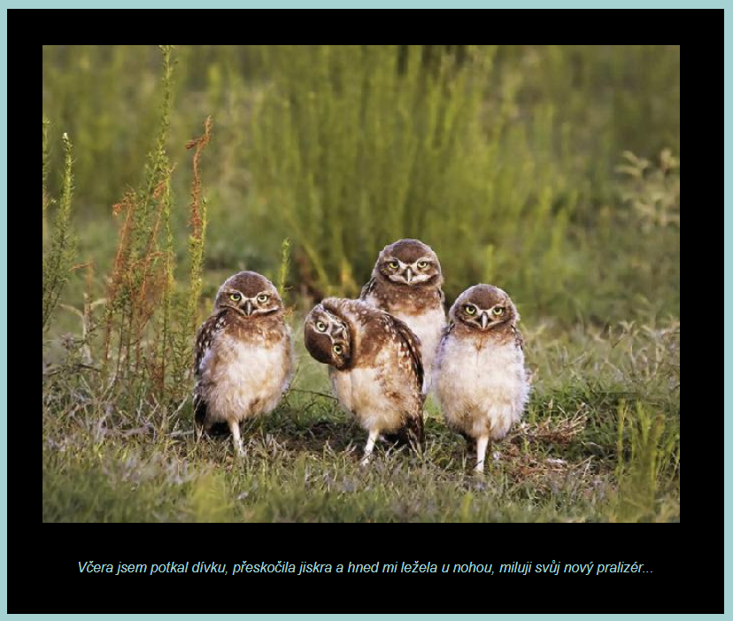

Lekce 02
========

Dynamicky generované webové stránky
-----------------------------------

### Videozáznam

Na YouTube se můžete podívat na [záznam z lekce](https://www.youtube.com/watch?v=BFcJyEdHtL8),
případně si prohlédnout [celý playlist](https://www.youtube.com/playlist?list=PLTCx5oiCrIJ6mcuJ1VaY8s0mzFsaMUzp-).

Úkol - Meme generátor
---------------------

Cílem domácího úkolu je vytvořit jednoduchou webovou aplikaci, která bude generovat obrázky s texty, a nasadit ji na váš
Tomcat.cloud.

### Popis

Cílem je udělat webovou aplikaci, která bude při obnovení stránky generovat náhodný obrázek, na kterém bude napsaný
náhodně vybraný text. K žádnému obrázku nebude text daný pevně - budou se náhodně vybírat a budou tak vznikat různé
kombinace.

Jak bude web vypadat, necháme na vás. Ukázkový web můžete vidět na
[http://margot.tomcat.cloud/ukol02/](http://margot.tomcat.cloud/ukol02/).

### Nepovinný bonus

Vylepšete nějak Meme generátor. Například tak (ale fantazii se meze nekladou), že se zobrazí 3 náhodné výroky a 3
náhodné obrázky. Zaručte, že se nikdy nebudou žádné dva výroky ani obrázky opakovat. Příklad si opět můžete vzít z dema:
[http://margot.tomcat.cloud/ukol02/pro-lepsi-naladu.html](http://margot.tomcat.cloud/ukol02/pro-lepsi-naladu.html). V
případě, že se rozhodnete udělat nepovinný bonus, nahrejte na Tomcat.cloud jen tento bonus a základní Meme generátor
není třeba vystavovat.

### Pár tipů

* Vyjděte ze šablony projektu z hodiny (Czechitas Java Web App Template). Složku si prostě okopírujte a otevřete ji v
  IntelliJ IDEA. Po otevření je nutné přejmenovat tato místa, kde je jméno a adresa aplikace uvedena v konfiguračních
  souborech:
  * PROJEKT/src/main/resources/application.properties -> server.context-path = /ukol02
  * PROJEKT/pom.xml -> /project/groupId = cz.czechitas.java2
  * PROJEKT/pom.xml -> /project/artifactId = ukol02
  * PROJEKT/pom.xml -> /project/name = Meme Generator
  * PROJEKT/pom.xml -> /project/build/finalName = ukol02
* Archív .war vytvoříte v pravém panelu Maven Projects -> Lifecycle -> clean a potom Maven Projects -> Lifecycle ->
  package.
* Pozor! Mezi zdrojovým projektem (složkou) a výsledným webovým archívem .war je velký rozdíl. Do Tomcatu se nasazuje
  výsledný archív .war, do odevzdávárny na Google Drivu se nahrává zazipovaná složka celého projektu.
* Do Tomcatu se NIKDY nekopíruje rozbalená složka webu, pouze archív .war. Tomcat si tento archív sám rozbalí.
* Pokud se chcete zbavit nasazené webové aplikace z Tomcatu a máte ho spuštěný, smažte pouze archív .war ve složce
  TOMCAT/webapps. Nemažte rozbalenou složku webu. Tomcat sám pozná, že jste odebrali zdrojový archív .war a rozbalenou
  složku smaže sám. To slouží zároveň jako potvrzení, že byla webová aplikace úspěšně sesazena. Pouze pokud byste měly
  Tomcat zastavený, smažte i rozbalenou složku v TOMCAT/webapps.
* Pro psaní doporučuji používat javový projekt se zabudovaným malým Tomcatem, který spustíte klasicky pomocí zelené
  šipky. Adresa vašeho webu je potom http://localhost:8080/ukol02. Případně místo /ukol02 to, co jste uvedly v
  application.properties -> server.context-path. V tomto případě stačí pouze editovat zdrojové soubory webu a obnovovat
  stránku v prohlížeči.
* Pro zajímavost, jméno výsledného archívu .war se nastavuje v PROJEKT/pom.xml -> /project/build/finalName

### Odevzdání domácího úkolu

Domácí úkol (celou složku s projektem, ne jen výsledný webový archív .war!) zabalte pomocí 7-Zipu pod jménem
**Ukol02-Vase_Jmeno.7z**. (Případně lze použít prostý zip, například na Macu). Takto vytvořený archív nahrajte na Google
Drive do složky Ukol02.

Takto vytvořený archív .war (ukol02.war) nasaďte do vašeho lokálního Tomcatu (JAVA-TRAINING/Tomcat/webapps) a
vyzkoušejte, že funguje ( http://localhost:8080/ukol02/ ).

Po odladění nasaďte tento archív ještě přes FTP na server Tomcat.cloud ( http://sladkost.tomcat.cloud/ukol02/ ).

Vytvořte snímek obrazovky spuštěného programu a pochlubte se s ním ve fotoalbu Ukol02 na Facebooku.

Pokud byste chtěli odevzdat revizi úkolu (např. po opravě), zabalte ji a nahrajte ji na stejný Google Drive znovu, jen
tentokrát se jménem **Ukol02-Vase_Jmeno-verze2.7z**
