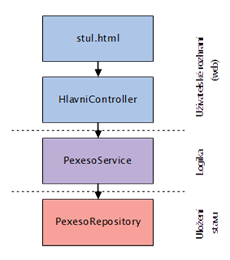
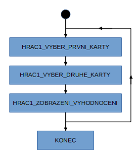

Lekce 10
========

Databáze II a návhové vzory Business Interface a Dependency Injection
---------------------------------------------------------------------

### Videozáznam

Na YouTube se můžete podívat na [záznam z lekce](https://www.youtube.com/watch?v=xh1RV4-I3A4),
případně si prohlédnout [celý playlist](https://www.youtube.com/playlist?list=PLTCx5oiCrIJ6mcuJ1VaY8s0mzFsaMUzp-).

Úkol - Pexeso na webu
---------------------

Ukolem je zprovoznit pexeso na webu.

Materialy pro pexeso najdete zde: [10-Pexeso-In\_memory](10-Pexeso-In_memory),
[20-Pexeso-Bez\_logiky](20-Pexeso-Bez_logiky).

Ukázkové pexeso můžete vidět na [https://margot.tomcat.cloud/ukol10/](https://margot.tomcat.cloud/ukol10/).

#### 1. Rozbehnuti a prozkoumani architektury

Vyjdete z **10-Pexeso-In_memory**. Nejprve si aplikaci spustte a vsimnete si, za co je ktera komponenta zodpovedna.

Chteli jste videt, jak se napise trosku vetsi realna aplikace. Tak tady ji mate :-)



Predevsim si vsimete komponenty **PexesoService**, do ktere je presunuta cela logika pexesa.

Dale si vsimete datoveho modelu, tedy trid **HerniPlocha** a **Karta**. Vsimete si, ze trida HerniPlocha ma ID, ktere se
pouziva na webu. Program tak umoznuje evidovat vice her soubezne (coz je na webu bezne).

Aktualne je aplikace stavova, tzn. ze je v programu uchovavan stav her. Pokud byste ji restartovaly, vsechny rozbehnute
hry se ztrati. Uchovavani stavu je zamerne separovano do jedine tridy - **PexesoRepository**.

Webova interakce je taky zajimava. Vsimnete si, jak spolu interaguje **stul.html** a **HlavniController**. Predevsim ze
kazdy pozadavek **GET** na **stul.html** zobrazi aktualni stav herni plochy. Zaroven kazdy pozadavek **POST** na
**stul.html** provede tah (vstupni parametr **vybranaKartaXX** urcuje, se kterou kartou byl proveden tah).

#### 2. Naprogramovani vlastni PexesoService

**Tento podukol je povinny jen pro pokrocile studentky.**

Zavrete **10-Pexeso-In_memory** a vyjdete z **20-Pexeso-Bez_logiky**. Ukolem je napsat vlastni logiku pexesa.

HlavniController pozaduje po PexesoService zhruba tyto sluzby (metody):

* **vytvorNovouHerniPlochu()**       -> vraci objekt HerniPlocha
* **najdiHerniPlochu(Long id)**      -> vraci objekt HerniPlocha
* **provedTah(Long idHerniPlochy, int cisloKartyNaKterouSeKliknulo)**

Prvni dve metody jsou jednoduche. **vytvorNovouHerniPlochu()** zalozi novou herni plochu se vsemi kartickami a ulozi ji
do **PexesoRepository**. Nove herni plose se priradi **ID**, podle ktereho bude **najdiHerniPlochu(Long id)** schopna
kdykoliv tuto herni plochu znovu vyzvednout.

Treti metoda, to je ta masita cast (veganky prominou :-). **provedTah(...)** se vola pri kliknuti na karticku
pexesa. Hra pexesa se muze nachazet v 1 z techto stavu:

* **HRAC1_VYBER_PRVNI_KARTY**,
* **HRAC1_VYBER_DRUHE_KARTY**,
* **HRAC1_ZOBRAZENI_VYHODNOCENI**,
* **KONEC**

Pokud byste chtely implementovat hru 2 hracu, stacilo by pridat par stavu a evidovat, ktery hrac je ktery. Pro
zjednoduseni to ale **nebudeme** uvazovat.



Podle stavu, ve kterem se hra nachazi, se interpretuje, co ma provest kliknuti na kartu.

* **HRAC1_VYBER_PRVNI_KARTY** ... vybrana karta se zobrazi licem nahoru (pokud byla rubem nahoru; jinak se tah ignoruje)
* **HRAC1_VYBER_DRUHE_KARTY** ... vybrana karta se zobrazi licem nahoru (pokud byla rubem nahoru; jinak se tah ignoruje)
* **HRAC1_ZOBRAZENI_VYHODNOCENI** ... vyhodnoti se, ktere karty jsou licem nahoru (museji byt prave 2) a pokud maji
  stejne cislo obrazku, nastavi se jako odebrane. Dale se hra prepne zase do prvniho stavu **HRAC1_VYBER_PRVNI_KARTY** nebo
  do stavu **KONEC**.
* **KONEC** ... znamena, ze uz nic dalsiho hra delat nebude.

Naprogramujte tedy chybejici metody v **PexesoService**. Tam kde je **// TODO**.

#### 3. Prevod na databazovou persistenci

Tento podukol je opet povinny pro vsechny!

Stav hry je separovan do komponenty **PexesoRepository**.

Aktualni verze uklada data v pameti, takze se pri restartu aplikace stav soubeznych her ztrati.

    public class PexesoRepository {
        private Map<Long, HerniPlocha> seznamHernichPloch;
    }

Ukolem je dopsat druhou verzi repository, ktera bude ukladat stav her do databaze a program pujde libovolne restartovat
bez ztraty stavu her. Tim padem se stane samotna javova cast bezstavovou (ZEN vsech webovych aplikaci).

Pokud jste delaly predchozi podukol, pokracujte v nem. Pokud ne, vyjdete z **10-Pexeso_in_memory**.

Postup:

1. Prejmenovani **PexesoRepository** na **InMemoryPexesoRepository**.
1. Vytvoreni **interface PexesoRepository** a nastaveni **InMemoryPexesoRepository** jako potomka interfacu
   **PexesoRepository**.
1. Vytvoreni noveho potomka **PexesoRepository** jmenem **JdbcTemplatePexesoRepository**.

#### Detailni popis 1 a 2

Postup jsme si ukazovali v hodine. Najdete na videu.

#### Detailni popis 3

Bude treba zalozit databazi na vasem lokalnim pocitaci. Vsechny z vas, prosim, pouzijte stejnou databazovou strukturu.

Na Tomcat.cloudu uz bude zalozena, takze tam ji nemusite vytvaret. Protoze se jednotlive hry identifikuji pomoci ID, vic
webovych aplikaci (jedna od kazde z vas) si na Tomcat.cloudu "nepoleze navzajem do zeli", takze spolu muzou v klidu
koexistovat nad 1 databazi.

```sql
CREATE DATABASE Pexeso
    CHARACTER SET utf8mb4
    COLLATE utf8mb4_czech_ci;

USE Pexeso;

CREATE TABLE HerniPlochy (
    ID INT PRIMARY KEY AUTO_INCREMENT,
    Stav VARCHAR(250),
    CasPoslednihoTahu TIMESTAMP DEFAULT now() NOT NULL
);

CREATE TABLE Karty (
    ID INT PRIMARY KEY NOT NULL AUTO_INCREMENT,
    HerniPlochaID INT NOT NULL,
    CisloKarty INT DEFAULT 0 NOT NULL,
    Stav VARCHAR(250) ,
    PoradiKarty INT NOT NULL DEFAULT 0,
    CONSTRAINT HerniPlocha_FK FOREIGN KEY (HerniPlochaID) REFERENCES HerniPlochy (ID)
);
```

Zde jsou metody pro pristup do databaze.

Zalozeni nove **HerniPlochy** v databazi:

```java
private HerniPlocha pridejHerniPlochu(HerniPlocha plocha) {
    GeneratedKeyHolder drzakNaVygenerovanyKlic = new GeneratedKeyHolder();
    String sql = "INSERT INTO HerniPlochy (Stav, CasPoslednihoTahu) VALUES (?, ?)";
    odesilacDotazu.update((Connection con) -> {
                PreparedStatement prikaz = con.prepareStatement(sql, Statement.RETURN_GENERATED_KEYS);
                prikaz.setString(1, plocha.getStav().name());
                prikaz.setObject(2, Instant.now());
                return prikaz;
            },
            drzakNaVygenerovanyKlic);
    plocha.setId(drzakNaVygenerovanyKlic.getKey().longValue());

    List<Karta> karticky = plocha.getKarticky();
    for (int i = 0; i < karticky.size(); i++) {
        Karta karticka = karticky.get(i);
        pridejKarticku(karticka, plocha.getId(), i);
    }
    return plocha;
}

private void pridejKarticku(Karta karticka, Long plochaId, int poradiKarty) {
    GeneratedKeyHolder drzakNaVygenerovanyKlic = new GeneratedKeyHolder();
    String sql = "INSERT INTO Karty (CisloKarty, Stav, HerniPlochaID, PoradiKarty) " +
            "VALUES (?, ?, ?, ?)";
    odesilacDotazu.update((Connection con) -> {
                PreparedStatement prikaz = con.prepareStatement(sql, Statement.RETURN_GENERATED_KEYS);
                prikaz.setInt(1, karticka.getCisloKarty());
                prikaz.setString(2, karticka.getStav().name());
                prikaz.setLong(3, plochaId);
                prikaz.setInt(4, poradiKarty);
                return prikaz;
            },
            drzakNaVygenerovanyKlic);
    karticka.setId(drzakNaVygenerovanyKlic.getKey().longValue());
}
```

Nalezeni **HerniPlochy** z databaze podle ID:

```java
public HerniPlocha findOne(Long id) {
    HerniPlocha herniPlocha = odesilacDotazu.queryForObject(
          "SELECT ID, Stav FROM HerniPlochy WHERE ID = ?",
          prevodnikPlochy,
          id);
    List<Karta> karticky = odesilacDotazu.query(
          "SELECT ID, CisloKarty, Stav FROM Karty WHERE HerniPlochaID = ?",
          prevodnikKarty,
          id);
    herniPlocha.setKarticky(karticky);
    return herniPlocha;
}
```

Update (ulozeni) stavu herni plochy do databaze, vcetne stavu karticek:

```java
private HerniPlocha updatuj(HerniPlocha plocha) {
    odesilacDotazu.update(
            "UPDATE herniplochy SET Stav = ?, CasPoslednihoTahu = ? WHERE ID = ?",
            plocha.getStav().name(),
            Instant.now(),
            plocha.getId());

    List<Karta> karticky = plocha.getKarticky();
    for (int i = 0; i < karticky.size(); i++) {
        Karta karticka = karticky.get(i);
        odesilacDotazu.update(
                "UPDATE karty SET Stav = ?, PoradiKarty = ? WHERE ID = ?",
                karticka.getStav().name(),
                i,
                karticka.getId());
    }
    return plocha;
}
```

Operace *update* a *insert* by bylo dobre provadet v transakci, ale to ted resit nebudeme. Pokud by to nekoho zajimalo,
zeptejte se na hodine.

### Odevzdání domácího úkolu

**Před odevzdáním úkolu smažte z projektu složku *target*!**

Domácí úkol (celou složku s projektem, ne jen výsledný webový archív .war!) zabalte pomocí 7-Zipu pod jménem
**Ukol10-Vase_Jmeno.7z**. (Případně lze použít prostý zip, například na Macu). Takto vytvořený archív nahrajte na Google
Drive do složky [Úkol 10](https://drive.google.com/drive/u/0/folders/1E1XPseFDGL-2dvoOhetWZTjCqprhtp6B).

Vytvořte archív .war v IntelliJ IDEA -> Maven Projects -> ukol -> Lifecycle -> clean a následně IntelliJ IDEA -> Maven
Projects -> ukol -> Lifecycle -> package. Goal "package" vytvoří archív .war v PROJEKT/target/ukol10.war. Nasaďte jej do
vašeho lokálního Tomcatu (JAVA-TRAINING/Tomcat/webapps) a vyzkoušejte, že funguje (http://localhost:8080/ukol10/).

Po odladění nasaďte tento archív ještě na server Tomcat.cloud.

Vytvořte snímek obrazovky spuštěného programu a pochlubte se s ním v galerii
[na Facebooku](https://www.facebook.com/media/set/?set=oa.712451492470082&type=3).

Pokud byste chtěli odevzdat revizi úkolu (např. po opravě), zabalte ji a nahrajte ji na stejný Google Drive znovu, jen
tentokrát se jménem **Ukol10-Vase_Jmeno-verze2.7z**.
